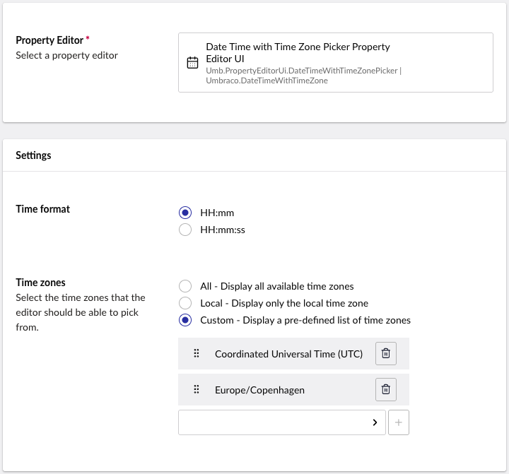

# Date Time (with Time Zone)

`Schema Alias: Umbraco.DateTimeWithTimeZone`

`UI Alias: Umb.PropertyEditorUi.DateTimeWithTimeZonePicker`

`Returns: DateTimeOffset?`

The Date Time with Time Zone property editor provides a comprehensive interface for selecting dates, times, and time zones. It stores values as ISO 8601 date/time strings with time zone information. This makes it ideal for applications that need accurate date handling across different time zones.

## Key Features

- Calendar-based date selection
- Configurable time precision (hours/minutes or hours/minutes/seconds)
- Flexible time zone configuration (all zones, local only, or custom selection)
- Automatic daylight saving time handling
- Type-ahead filtering for time zone selection
- Returns strongly-typed `DateTimeOffset?` values

## Configuration
You can configure this property editor in the same way as any standard property editor, using the *Data Types* admin interface.

To set up a property using this editor, create a new *Data Type* and select **Date Time (with time zone)** from the list of available property editors.

You will see the configuration options as shown below.



- **Time format** - Specifies the level of precision for time values shown and stored by the editor.
- **Time zones** - Controls how time zones are available in the property editor.

### Time format

- **HH:mm** - Displays hours and minutes (e.g., `14:30`).  
Suitable for most general use cases.  

- **HH:mm:ss** - Displays hours, minutes, and seconds (e.g., `14:30:45`).  
Use this when you need more precise timing.  


### Time zones

- **All** - Displays the full list of IANA time zones (e.g., `America/New_York`, `Europe/Stockholm`).
- **Local** - Displays only the local time zone of the user's browser/computer.
Useful for simplifying the UI when time entries should always be based on the user’s local context.
- **Custom** - Allows you to define a list of time zones.
When you select this option, a dropdown appears. You can search and select from the full IANA time zone list. Add multiple zones to restrict user selection to only the zones you specify.
    - Example:  
        Selecting the following time zones:
        - `Coordinated Universal Time (UTC)`
        - `Europe/Copenhagen`  
        Will result in the following editing experience:  
        

The selected time zone affects how the date/time is displayed and stored.  
When you select a time zone, the value will be saved with the corresponding offset (e.g., `2025-01-01T14:30:00+01:00`).  
Daylight saving time (DST) is also taken into account.

## Editing experience

### Adding or editing a value

You will be presented with date, time and time zone inputs. The time zone input allows typing, which filters the list of presented time zones.


If your browser time zone is in the list and no date has been stored yet, the browser time zone will be pre-selected by default.

If only one time zone is available, you will see a simple label with the time zone name instead.


## Rendering

The value returned will have the type `DateTimeOffset?`. This allows you to work with the date/time value while preserving time zone information.

### Display the value

With Models Builder:
```csharp
@Model.EventDateTime.Value
```

Without Models Builder:
```csharp
@Model.Value<DateTimeOffset?>("eventDateTime")
```

### Value conversions

Convert to local time:
```csharp
DateTimeOffset? localTime = Model.EventDateTime?.ToLocalTime();
```

Convert to UTC time:
```csharp
DateTimeOffset? utcTime = Model.EventDateTime?.ToUniversalTime();
```

Convert to DateTime:
```csharp
DateTime? dateTime = Model.EventDateTime?.DateTime;
DateTime? utcDateTime = Model.EventDateTime?.UtcDateTime;
```

## Add values programmatically

This property editor stores values as a JSON object. The object contains both the date (as an ISO 8601 string) and the selected time zone (as an IANA identifier).

### Storage format

The property editor stores values in this JSON format:
```json
{
    "date": "2025-01-01T00:01:00+01:00",
    "timeZone": "Europe/Copenhagen"
}
```

1. Create a C# model that matches the JSON schema.

    ```csharp
    using System.Text.Json.Serialization;

    namespace UmbracoProject;

    public class DateTimeWithTimeZone
    {
        /// <summary>
        /// The date and time value, represented as a <see cref="DateTimeOffset"/>.
        /// </summary>
        [JsonPropertyName("date")]
        public DateTimeOffset Date { get; init; }

        /// <summary>
        /// The IANA identifier of the time zone to pre-select in the editor. E.g., "Europe/Copenhagen".
        /// </summary>
        [JsonPropertyName("timeZone")]
        public string TimeZone { get; init; }
    }
    ```

2. Create an instance of the created class with the desired values.
   ```csharp
   var value = new DateTimeWithTimeZone
   {
       Date = DateTimeOffset.Now, // The date and time value to store.
       TimeZone = "Europe/Copenhagen" // The time zone to pre-select in the editor.
   };
   ```

3. Inject the `IJsonSerializer` and use it to serialize the object.
   ```csharp
   var jsonValue = _jsonSerializer.Serialize(value);
   ```

4. Inject the `IContentService` to retrieve and update the value of a property of the desired content item.
   ```csharp
   IContent content = _contentService.GetById(contentKey) ?? throw new Exception("Content not found");

   // Set the value of the property with alias 'eventDateTime'. 
   content.SetValue("eventDateTime", jsonValue);

   // Save the change
   _contentService.Save(content);
   ```
