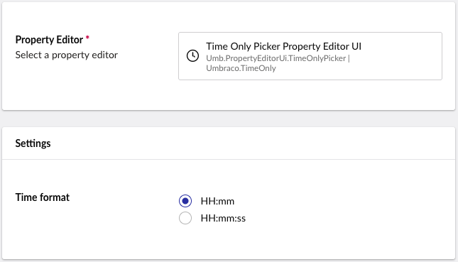

# Time Only

`Schema Alias: Umbraco.TimeOnly`

`UI Alias: Umb.PropertyEditorUi.TimeOnlyPicker`

`Returns: TimeOnly?`

The Time Only property editor provides a simple interface for selecting times. It excludes date or time zone information and returns strongly-typed `TimeOnly` values.

## Key Features

- Time-based input selection
- Configurable time precision (hours/minutes or hours/minutes/seconds)
- No date or time zone components
- Simple, focused interface for time values
- Returns strongly-typed `TimeOnly?` values
- Ideal for business hours, schedules, and time-based events

## Configuration
You can configure this property editor in the same way as any standard property editor, using the *Data Types* admin interface.

To set up a property using this editor, create a new *Data Type* and select **Time Only** from the list of available property editors.

You will see the configuration options as shown below.



- **Time format** - Specifies the level of precision for time values shown and stored by the editor.

### Time format

- **HH:mm** - Displays hours and minutes (e.g., `14:30`).  
Suitable for most general use cases.  

- **HH:mm:ss** - Displays hours, minutes, and seconds (e.g., `14:30:45`).  
Use this when you need more precise timing.  


## Editing experience

### Adding or editing a value

You will be presented with a time input. Unlike date-time editors, this editor focuses only on the time component.


## Rendering

The value returned will have the type `TimeOnly?`.

### Display the value

With Models Builder:
```csharp
@Model.StartHours
```

Without Models Builder:
```csharp
@Model.Value<TimeOnly?>("startHours")
```

## Add values programmatically

This property editor stores values as a JSON object. The object contains the time as an ISO 8601 string with a default date and UTC offset.

### Storage format

The property editor stores values in this JSON format:
```json
{
    "date": "0001-01-01T14:30:00+00:00"
}
```

The property editor handles time-only values. Date is set to a default value (0001-01-01) and offset to +00:00 for storage consistency. The date component is ignored in Time Only context.

1. Create a C# model that matches the JSON schema.

    ```csharp
    using System.Text.Json.Serialization;

    namespace UmbracoProject;

    public class TimeOnlyValue
    {
        /// <summary>
        /// The time value, represented as a <see cref="DateTimeOffset"/> for storage compatibility.
        /// </summary>
        [JsonPropertyName("date")]
        public DateTimeOffset Date { get; init; }
    }
    ```

2. Convert your existing time value to `DateTimeOffset` for storage.

   If you have a `TimeOnly`:
   ```csharp
   TimeOnly timeOnly = TimeOnly.FromDateTime(DateTime.Now); // Your existing TimeOnly value
   DateTimeOffset dateTimeOffset = new DateTimeOffset(DateOnly.MinValue, timeOnly, TimeSpan.Zero);
   ```

   If you have a `DateTime`:
   ```csharp
   DateTime dateTime = DateTime.Now; // Your existing DateTime value
   TimeOnly timeOnly = TimeOnly.FromDateTime(dateTime);
   DateTimeOffset dateTimeOffset = new DateTimeOffset(DateOnly.MinValue, timeOnly, TimeSpan.Zero);
   ```

3. Create an instance of the class with the `DateTimeOffset` value.
    ```csharp
    TimeOnlyValue value = new TimeOnlyValue
    {
        Date = dateTimeOffset
    };
    ```

4. Inject the `IJsonSerializer` and use it to serialize the object.
   ```csharp
   string jsonValue = _jsonSerializer.Serialize(value);
   ```

5. Inject the `IContentService` to retrieve and update the value of a property of the desired content item.
   ```csharp
   IContent content = _contentService.GetById(contentKey) ?? throw new Exception("Content not found");

   // Set the value of the property with alias 'startHours'. 
   content.SetValue("startHours", jsonValue);

   // Save the change
   _contentService.Save(content);
   ```
