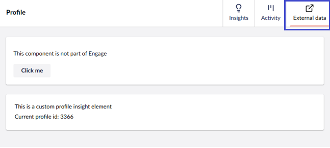

# External Profile Data

Your system may associate an Umbraco Engage visitor with other data coming from an external system such as a Customer Relation Management (CRM) system.

If you want to use external data in a custom segment you have to write the data access yourself in the custom segment code.

## Visualization

It is possible to visualize this external data alongside the Umbraco Engage profile in the backoffice by providing a custom `AngularJS` component for this purpose.

When this component is registered a new tab will be rendered in the Profiles section when viewing profile details. This will render the custom component that was provided and get passed the Umbraco Engage visitor ID.



### Register custom components

To render this External Profile Tab with a custom component, you have to create your component and register it with Umbraco Engage. The following code will show how to do both. Add the below code in a Typescript file:

```typescript
// Create a component. We create a component named "myCustomExternalProfileDataComponent" here:

const element = "myCustomExternalProfileDataComponent";
@customElement(element)
export class CustomExternalDataElement
  extends UmbLitElement
  implements UmbWorkspaceViewElement
{
  @state()
  private _components?: Array<ManifestUeExternalDataComponent["ELEMENT_TYPE"]>;

  constructor() {
    super();

    this.observe(
      umbExtensionsRegistry.byType(ENGAGE_EXTERNAL_DATA_EXTENSION_TYPE),
      async (data) => {
        if (!data) return;
        this._components = await Promise.all(
          data
            .sort((a, b) => (b.weight ?? 0) - (a.weight ?? 0))
            .map((d) => createExtensionElement(d))
        );
      }
    );
  }

  render() {
    return html`
      ${this._components?.map(
        (component) => html` <uui-box> ${component} </uui-box>`
      )}
    `;
  }
}

export default CustomExternalDataElement;

declare global {
  interface HTMLElementTagNameMap {
    [element]: CustomExternalDataElement;
  }
}
```

Then, load your component using a `manifest.ts` file:

```json
{
    type: "workspaceView",
    kind: ENGAGE_PROFILE_DETAIL_WORKSPACE_VIEW_KIND,
    alias: "Engage.Profile.Details.ExternalData.WorkspaceView",
    name: "Engage Profile Details External Data",
    element: () =>
    import("path-to-your-component"),
    meta: {
        label: "External Data",
        pathname: "path-name",
        icon: "your-custom-icon",
    },
    conditions: [
    {
        alias: UMB_WORKSPACE_CONDITION_ALIAS,
        match: ENGAGE_PROFILE_DETAILS_WORKSPACE_ALIAS,
    },
    {
        alias: ENGAGE_EXTERNAL_DATA_PACKAGE_CONDITION_ALIAS,
    },
    ],
}
```

This is all that is required to render your custom component.
