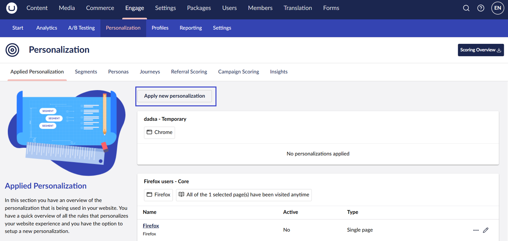

# Setting up Personalization


Ensure you have set up [your first segment](creating-a-segment.md), which is a group of visitors you want to target for personalized website experiences.

Once that is done, you can move on to the next step and personalize the experience.


## Applying personalization

You can apply personalization in two ways:

* On a specific page
* Via the personalization section

### Personalizing a specific page

To personalize a specific page:

1. Go to any content node within Umbraco.
2. Open the node. You will find all Umbraco Engage content apps on that specific node.
3. Go to the "**Personalization**" content app:

4. Clicking the content app takes you to an overview of all applied personalizations for the page.
5. Click **Create personalized variant**:

6. Select the segment from the dropdown for which you want to personalize the experience in the popup.
7. Provide a descriptive name for the personalization and a short description:

8. Click **Save**.
9. A split-view editor opens up, where you can create a personalized variant on the right side of the original page.

10. Edit specific properties of your Document Type depending on your segmentation setup. To set this up correctly, see the [Setting up the Document Type for splitview editing](../ab-testing/types-of-ab-tests/single-page-ab-test.md) article.

For example, you can specify a different title for this variant:

11. Click **Save & Preview** to save and preview your applied personalization.

While previewing the personalization, you will see an extra querystring in the URL: `https://<your url>/?engagePreviewAppliedPersonalization=<id>`

This is only visible when previewing your personalization. Once published, visitors will see a single URL, and depending on their segment, they will view different content.

After publishing the website, visitors in the segment will see the personalized variant, while others will see the default content.

Congratulations, you've successfully set up your first personalization.

## Applying personalization to multiple pages or per Document Type

You can also apply personalization to multiple pages at once. This can only be setup via the Engage section in Umbraco. Within that section you can go to the subsection **Personalization** and click on **Apply new personalization**:

Here, you can specify to which pages or Document Types you want to apply the personalization. Also you need to specify for which segment this is triggered.

With multiple pages and Document Types you can either add in some additional `CSS` or `JavaScript` code or personalize the experience via code. You can add CSS `JavaScript` via the button "**Include CSS/JavaScript**". The `CSS` and `JavaScript` will automatically be added to the pages where the segment applies.
