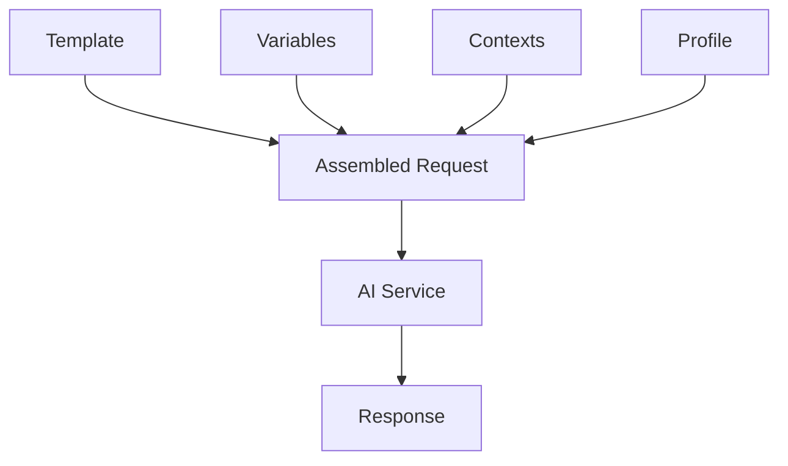

# Prompt Concepts

## What is a Prompt?

A prompt is a reusable template that defines instructions for an AI operation. Prompts combine:

- **Instructions** - The actual prompt text with variable placeholders
- **Profile** - Which AI profile (model/settings) to use
- **Contexts** - Brand voice and guidelines to inject
- **Scope** - Allow and deny rules defining where this prompt can run

## Prompt Properties

| Property               | Description                           |
| ---------------------- | ------------------------------------- |
| `Alias`                | Unique identifier for code references |
| `Name`                 | Display name in the backoffice        |
| `Description`          | Optional description                  |
| `Instructions`         | Prompt template text                  |
| `ProfileId`            | Associated AI profile (optional)      |
| `ContextIds`           | AI Contexts to inject                 |
| `Tags`                 | Organization tags                     |
| `IsActive`             | Whether the prompt is available       |
| `IncludeEntityContext` | Include entity info in system message |
| `Scope`                | Allow/deny rules for where the prompt runs |

## How Prompts Work

When you execute a prompt:

1. **Template is loaded** - The prompt template is retrieved
2. **Variables are resolved** - Placeholders are replaced with values
3. **Contexts are injected** - Associated contexts add to the system message
4. **Profile is applied** - The linked profile provides model/settings
5. **Guardrails evaluated** - Pre-generate guardrails check the input
6. **Request is sent** - The AI operation executes
7. **Guardrails evaluated** - Post-generate guardrails check the response
8. **Response is logged** - Audit log captures the operation

## Variable Resolution

Variables use the `{{variable}}` syntax. At execution time:

1. **Explicit variables** - Provided in the execution request
2. **Entity variables** - Extracted from the content entity
3. **Property variables** - Content properties by alias
4. **Context variables** - Execution context (culture, etc.)

### Resolution Order

When the same variable appears multiple places, explicit variables take precedence:

1. Explicit (from request)
2. Entity-prefixed
3. Property-prefixed
4. Default value (if defined)

## Prompt Scoping

Scoping controls where a prompt is allowed to run. A scope is made up of two lists:

- **Allow Rules** - Whitelist the places the prompt can be used. At least one allow rule must match for the prompt to execute.
- **Deny Rules** - Blacklist the places the prompt cannot be used. Deny rules take precedence over allow rules.

Each rule can match against content type aliases, property aliases, and/or property editor UI aliases.


A prompt with no scope (or with no allow rules) is not allowed to run anywhere. See [Scoping](scoping.md) for full details.


## Version History

Every change to a prompt creates a new version:

- View the complete history of changes
- Compare any two versions
- Rollback to a previous version
- Track who made each change

## Best Practices

- **Be specific in templates** - Clear instructions with examples and constraints (length, format, tone) produce better results.
- **Use meaningful aliases** - Use descriptive names like `summarize-article` rather than `prompt-1`, and tag by purpose.
- **Associate profiles explicitly** - Do not rely on defaults; choose the right model for the task.
- **Deactivate rather than delete** - Archive unused prompts to preserve history.

## Related

- [Template Syntax](template-syntax.md) - Variable interpolation details
- [Scoping](scoping.md) - Allow and deny rules
- [Guardrails](../../concepts/guardrails.md) - Safety and compliance rules
