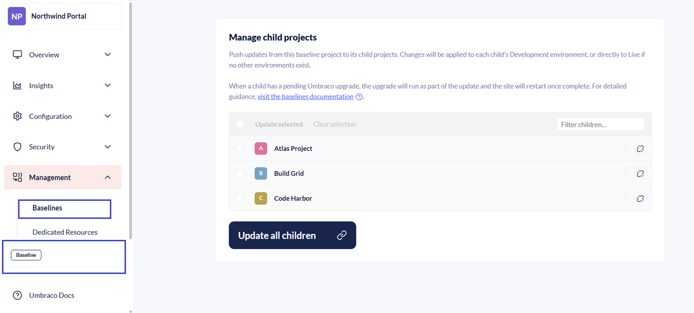
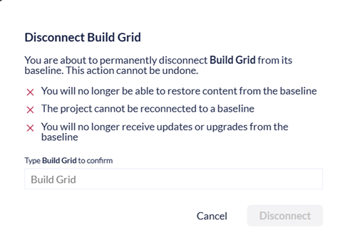

# Break Reference between Baseline and Child Project

To remove the connection between a Baseline and a Child project, you need admin privileges. Once disconnected, the Child project becomes a standalone project and will no longer receive updates from the Baseline.


This action cannot be undone.


1. Go to the Baseline project in the Umbraco Cloud portal.
2. Click the **Baseline** label at the bottom of the left-side menu. Alternatively, go to **Management** > **Baselines**.
3. Click the  next to the Child project you want to disconnect.

   A window displaying the consequences of this action appears.
4. Enter the Child project name you wish to disconnect.
5. Click **Disconnect**.

   
